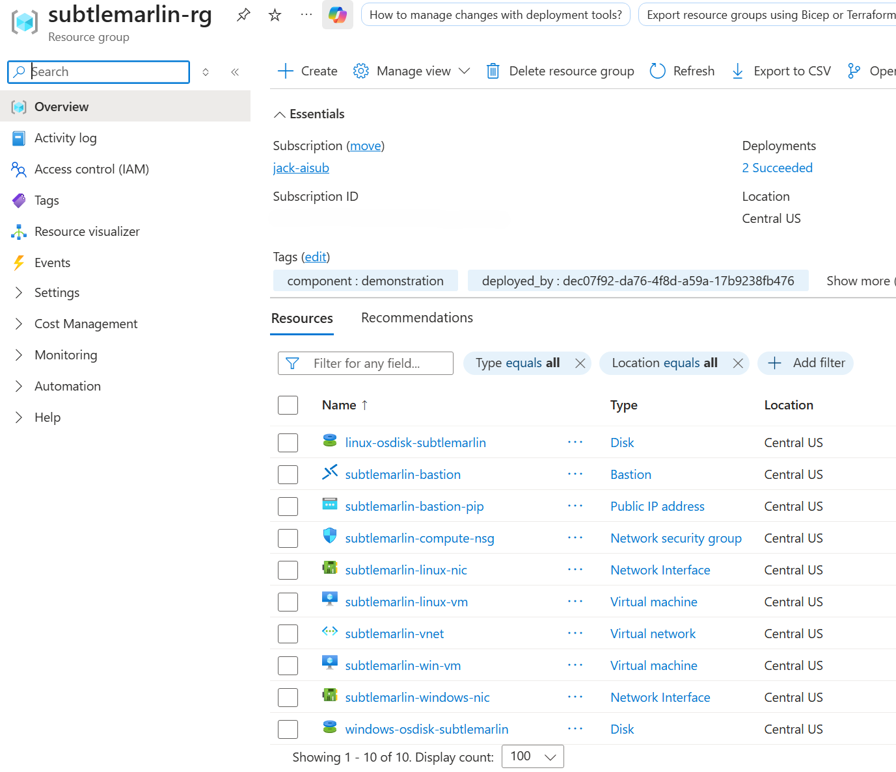
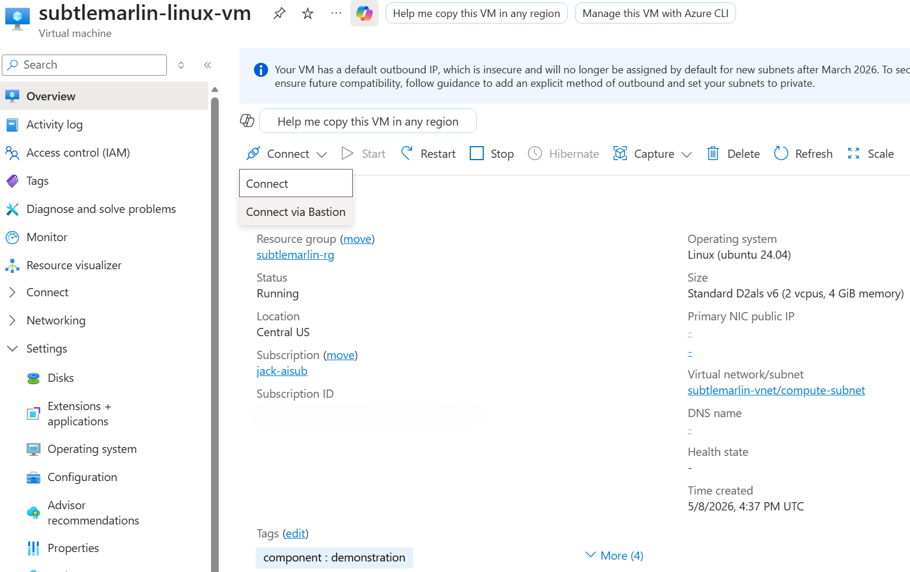
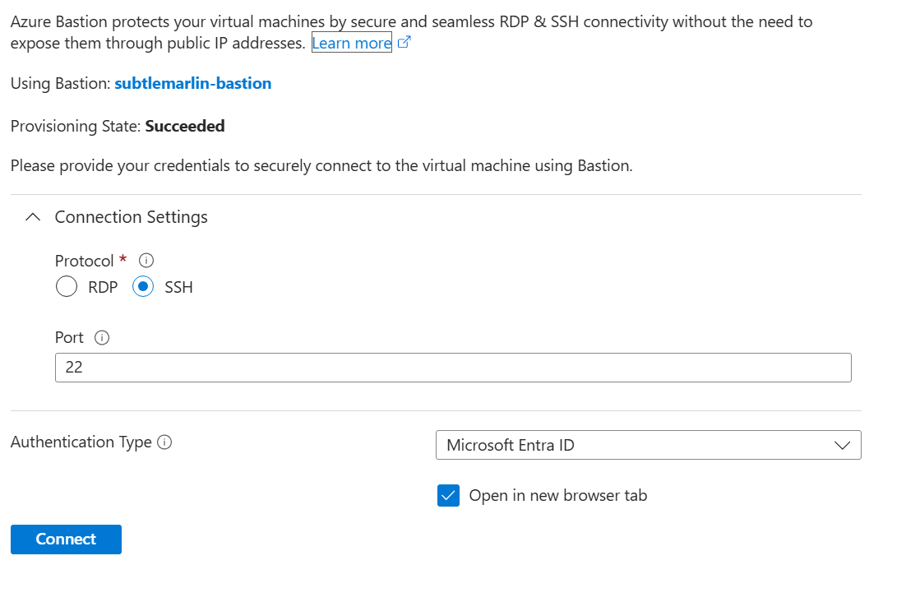
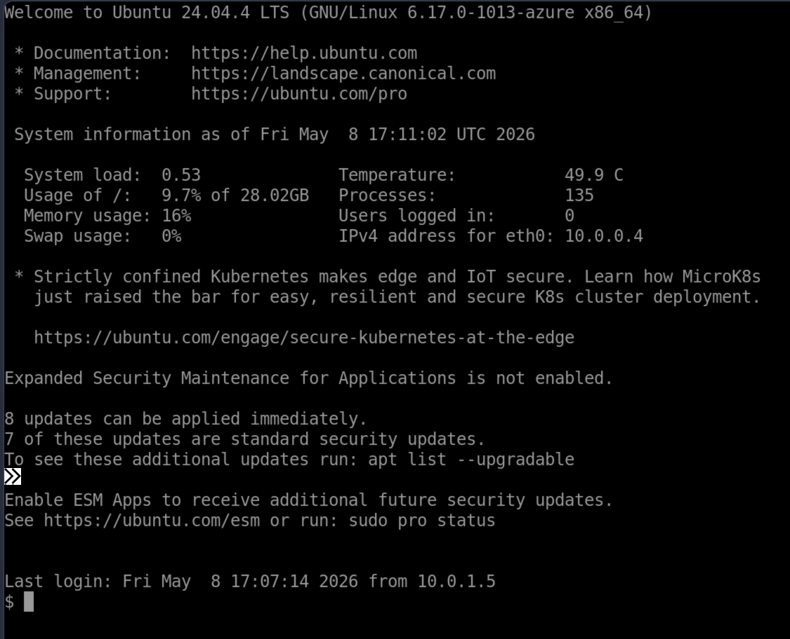
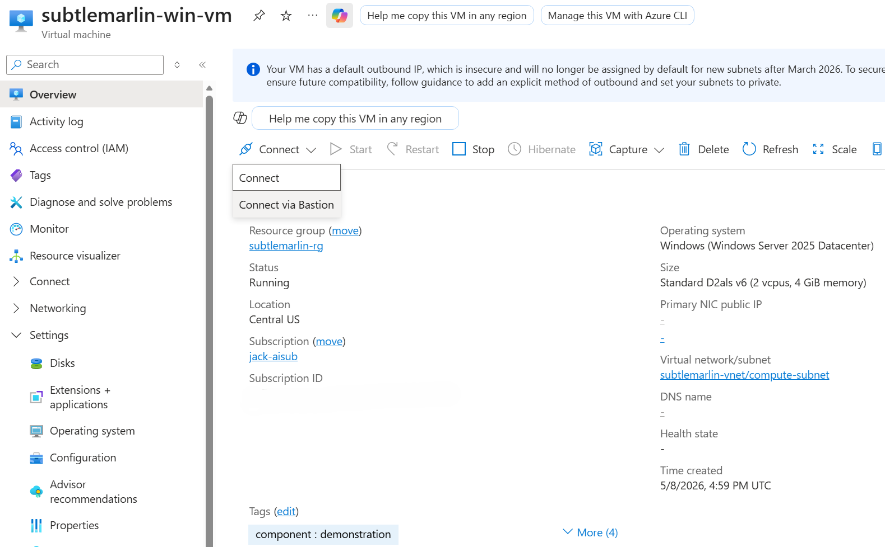
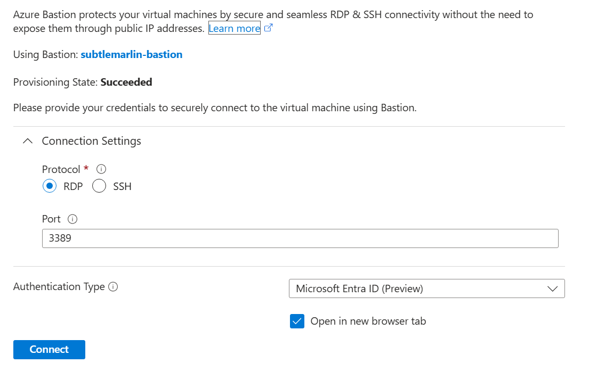
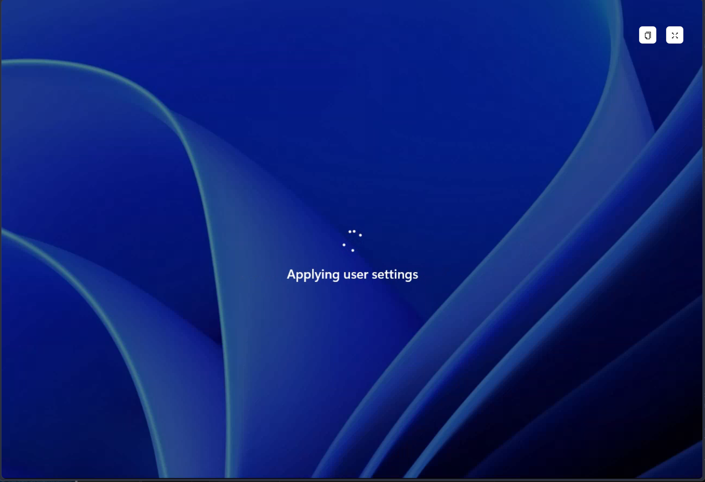

In a [previous post](/posts/terraform-azurekeyvault/) I walked through how to get SSH keypairs out of your laptop and into Azure Key Vault using Terraform's new `ephemeral` and write-only features. That works great for the HPC crowd that lives and dies by SSH — but it still leaves you managing keys.

A lot of my customers would rather not manage keys at all. They already have an identity platform: Microsoft Entra ID. So this post takes the other path I teased in the Key Vault write-up — using Entra ID to authenticate to both Linux *and* Windows VMs in Azure, with no SSH keys and no local Windows password to hand out.

The pattern lives on my GitHub: 

## What we're building

The Terraform in this repo deploys a small, self-contained playground:

- A resource group with a `random_pet` prefix so multiple deploys can co-exist.
- A virtual network with a `compute-subnet` for the VMs and an `AzureBastionSubnet`.
- A network security group on the compute subnet — no inbound rules, because everything goes through Bastion.
- A Standard SKU **Azure Bastion** with tunneling, IP-connect and shareable links enabled.
- An **Ubuntu 24.04 LTS** VM with a system-assigned managed identity and the `AADSSHLoginForLinux` extension.
- A **Windows Server 2025 Datacenter** VM with a system-assigned managed identity and the `AADLoginForWindows` extension.
- A `Virtual Machine Administrator Login` role assignment at the resource-group scope, granted to whichever principal Terraform authenticated as (overridable via `login_principal_id`).

The repo layout mirrors what I do everywhere else — one concern per file:

```text
terraform/
├── compute.tf        # NICs, both VMs, Entra login extensions
├── locals.tf         # Common tag merge
├── main.tf           # RG, random naming, random password, role assignment
├── network.tf        # VNet, subnets, NSG, Bastion + PIP
├── outputs.tf        # Resource group / VM / bastion names
├── providers.tf      # Required versions and azurerm features
├── variables.tf      # All inputs
└── environments/
    ├── creds.example.tfvars   # Template — copy to creds.tfvars locally
    └── creds.tfvars           # Gitignored
```

## Why Entra ID for VM login

Two things drove me to this pattern:

1. **No SSH keys to rotate, lose, or accidentally commit.** The Linux VM trusts Entra ID via the `AADSSHLoginForLinux` extension, and `az ssh vm` mints a short-lived certificate for you on the fly.
2. **No local Windows password to share around.** The `AADLoginForWindows` extension lets you RDP through Bastion as your Entra user, with MFA and Conditional Access in front.

The local admin account still exists as a break-glass — its password is generated by `random_password` — but the *intended* path in and out of these boxes is Entra ID.

## Prerequisites

- Terraform `>= 1.14`
- Azure CLI (for `az login` and `az ssh vm`)
- An Azure subscription where you can create resource groups, VMs and a Standard SKU Bastion
- Permission in your Entra tenant to assign the `Virtual Machine Administrator Login` role at the resource-group scope

## Authenticating Terraform

The provider block intentionally doesn't hard-code anything. For dev work I just lean on the Azure CLI:

```shell
az login
az account set --subscription <subscription-id>
export ARM_SUBSCRIPTION_ID=<subscription-id>
```

For CI, copy the example tfvars to `creds.tfvars` (which is gitignored) and source it before running Terraform:

```shell
cp terraform/environments/creds.example.tfvars \
   terraform/environments/creds.tfvars
# edit creds.tfvars with ARM_CLIENT_ID, ARM_CLIENT_SECRET, ARM_TENANT_ID, ARM_SUBSCRIPTION_ID
set -a; source terraform/environments/creds.tfvars; set +a
```

> [!WARNING]
> Never commit a populated `creds.tfvars`. If you have ever pushed one, rotate that client secret in Entra ID immediately. Workload Identity Federation is the better answer for any pipeline that supports it.

## Deploy it

```shell
cd terraform
terraform init
terraform plan -out tfplan
terraform apply tfplan
```

Once `apply` finishes, the outputs will give you the resource group name, both VM names, and the Bastion name — which is everything you need for the rest of this post.

## What you should see in the portal

After the apply lands, pop into the Azure portal and open the resource group. You should see the resource group is populated with the network plumbing, both VMs, the Bastion and its public IP, and not much else:



Notice the `deployed_by` tag on the resource group — that's coming from the `azuread` provider, which resolves the current Terraform identity to its Entra display name and stamps it on every resource via `locals.tf`.

## Signing in to the Linux VM

There are two equally valid ways to get a shell on the Linux VM. I'll walk through both.

### Option 1 — `az ssh vm` from your terminal

This is my preferred path because it doesn't need a browser at all. With the `AADSSHLoginForLinux` extension installed and the role assignment in place, the Azure CLI handles the certificate dance for you:

```shell
az ssh vm \
  --resource-group "$(terraform output -raw resource_group_name)" \
  --vm-name       "$(terraform output -raw linux_vm_name)"
```

No SSH keys, no `~/.ssh/known_hosts` drama, no local password.

> [!NOTE]
> `az ssh vm` against a Bastion-only VM requires Bastion's tunneling/native-client features, which are enabled in the Standard SKU deployed here. If you're behind a corporate proxy that blocks the tunnel, fall back to Option 2.

### Option 2 — Bastion from the portal

If you'd rather click your way in, open the Linux VM in the portal and pick **Connect → Connect via Bastion**:



On the Bastion blade, choose **SSH** as the protocol, leave the port at `22`, and set **Authentication Type** to **Microsoft Entra ID**:



Click **Connect**, complete the Entra prompt in the new tab, and you're dropped straight into a shell — no key, no password:



That `Last login: ... from 10.0.1.5` line is Bastion itself — the host on the `AzureBastionSubnet` that brokered the connection.

## Signing in to the Windows VM

The Windows side follows the same pattern. From the resource group, open the Windows VM and again pick **Connect → Connect via Bastion**:



This time on the Bastion blade, choose **RDP** as the protocol, leave the port at `3389`, and set **Authentication Type** to **Microsoft Entra ID**:



Bastion will open a new tab, hand you off to Entra for sign-in (including any MFA / Conditional Access policies your tenant enforces), and then RDP into the box as your Entra identity:



The first sign-in spends a moment on **Applying user settings** while Windows builds the profile for your Entra user — after that, subsequent sign-ins are quick.

## A note on roles

Whoever you want to be able to sign in needs the `Virtual Machine Administrator Login` (or `Virtual Machine User Login`) role on the VM, the resource group, or the subscription. The Terraform here grants `Virtual Machine Administrator Login` at the resource group scope to whichever principal Terraform authenticated as — usually you. To grant it to a different user or group instead, set:

```hcl
login_principal_id = "<entra-object-id>"
```

in your tfvars and re-apply.

## Cleanup

```shell
terraform destroy
```

Because every resource is tagged and named off the same `random_pet`, you can re-apply with a clean slate as many times as you like.

## Known limitations

- **Password in state.** The local admin password is generated by `random_password` and lives in Terraform state. Once the AzureRM provider exposes write-only support (`admin_password_wo` / `admin_password_wo_version`) for VM resources, I'll switch this over to an `ephemeral` block — same pattern I used in the [Key Vault post](/posts/terraform-azurekeyvault/). The intended path in is Entra ID, so the local password should rarely be touched.
- **Local backend.** State is on disk. For shared use, swap in an Azure Storage backend with state locking in `providers.tf`.
- **No automated tests.** A few `*.tftest.hcl` files for plan-time assertions would be a good next step.

## Wrapping up

Between the [Key Vault SSH key post](/posts/terraform-azurekeyvault/) and this one, you've now got two clean Terraform patterns for Azure VM access:

- **SSH keys, but cloud-native** — generated as ephemeral material and parked in Key Vault, perfect for HPC clusters where SSH is the lingua franca.
- **No keys at all** — Entra ID sign-in for both Linux and Windows, fronted by Bastion, with MFA and Conditional Access doing the heavy lifting.

For most net-new workloads I reach for this Entra-based pattern first. The VMs end up with a smaller blast radius, the joiner / mover / leaver story is whatever your existing Entra processes already are, and there's just less to lose.
